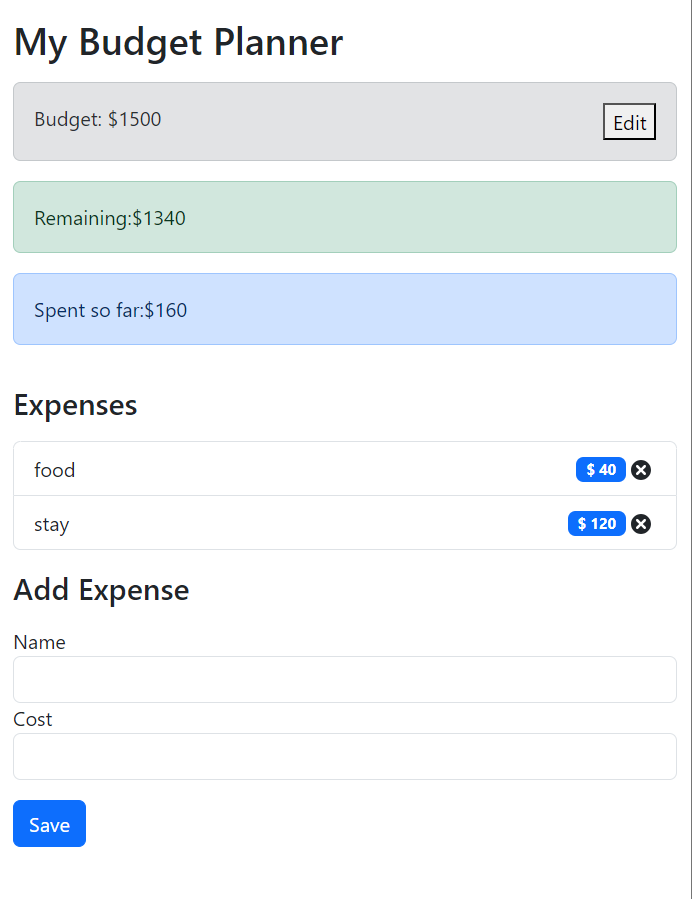

# Simple Budget Tracker

Welcome to the Simple Budget Tracker project! This application is a straightforward budget management tool built using React and Bootstrap.

## Description

The Simple Budget Tracker allows users to easily manage their budgets. Users can edit their budget, track expenses, and view the remaining balance. The project is designed to be responsive, with a user-friendly interface.

## Preview

## Features

- Edit the budget and see adjustments in spent and remaining amounts.
- Add expenses by providing a name and cost.
- Responsive design, with enhanced aesthetics in a narrower window.

## Usage

1. Explore the [Simple Budget Tracker](https://keya161.github.io/BudgetTracker/) website.
2. Edit the budget to set your financial goals.
3. Add expenses by providing a name and cost.
4. Observe real-time adjustments to spent and remaining amounts.

## Technologies Used

- React
- Bootstrap

## Acknowledgments

This project was created to demonstrate the use of React and Bootstrap in developing a simple and responsive budget tracker.

Feel free to delve into the code and provide feedback or suggestions!

